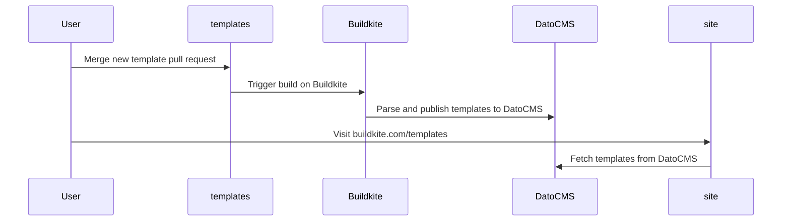

# How to contribute a pipeline template

You can add a new pipeline template to this repository by using the following structure:

```
.
└── your-template-name/
    ├── pipeline.yaml
    ├── README.md
    └── example-project
        └── ...
```

## `pipeline.yaml`

The Buildkite [pipeline definition](https://buildkite.com/docs/pipelines/defining-steps) for the template.

## `README.md`

A high-level description of your template definition and how it works.

Use the [`EXAMPLE_README.md`](./EXAMPLE_README.md) file in the root directory of this repository to get started. It contains example text, a key to the required front matter, and a content guide.

## `example-project` (optional)

An example project with relevant boilerplate code to test the pipeline definition in isolation.

> [!TIP]
> You can use the [Buildkite CLI](https://github.com/buildkite/cli) to run the pipeline locally from the `example-project` directory with the following command:
>
> ```sh
> bk local run ../pipeline.yaml
> ```

# Publication on Buildkite.com

The templates defined in this repository are ingested into DatoCMS on merge.


