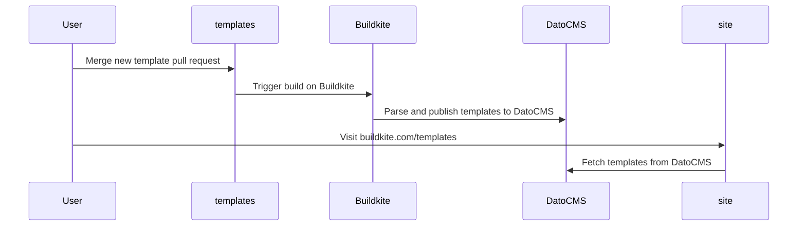

# How to contribute a pipeline template

You can add a new pipeline template to this repo by using the following structure:

```
.
└── snowflake-data-ingestion-pipeline/
    ├── pipeline.yaml
    └── README.md
    └── example-project
        └── ...
```

## `pipeline.yaml`

A Buildkite Pipeline definition [file](https://buildkite.com/docs/pipelines/defining-steps).

## `README.md`

Your `README.md` should contain a high-level description of your template definition and how it works.

Use the [`BLANK_README.md`](https://github.com/buildkite/templates/blob/main/BLANK_README.md) file in the root directory of this repo to get started. It contains example text along with a key to required front matter, plus a content guide.

## `example-project` (optional)

Having an example project with relevant boilerplate makes it possible to test pipeline yaml in isolation.

It's paricularly useful when paired with the Buildkite CLI by running the following command:

```sh
cd my-template-ci/example;
bk local run ../pipeline.yaml
```

# Publication on Buildkite.com

The templates defined in this repository are ingested into DatoCMS on merge.


