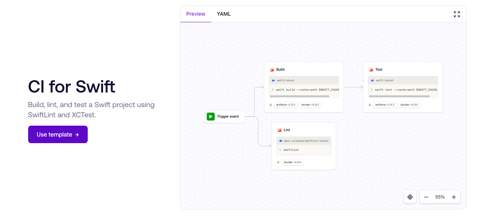

# Buildkite Pipeline Templates

_[Swift CI template](https://buildkite.com/pipelines/templates/ci/swift)_

A collection of templates to help you get started quickly with [Buildkite Pipelines](https://buildkite.com/pipelines), available to view in the [Buildkite template gallery](https://buildkite.com/pipelines/templates).

## What are they?

Each template is a Buildkite pipeline performing a specific task using typical technologies and programming languages. For example, the [Ruby CI template](https://buildkite.com/pipelines/templates/ci/ruby-ci) is an example of doing continuous integration (CI) in Ruby using Rubocop and Rspec.

## How do they work?

Each template is stored as a root level folder, containing a pipeline YAML file and readme. When viewed on the Buildkite website, users can click 'Use Template' to create a new pipeline in their account using the templated pipeline steps.

## Requesting templates

Request a new template by [opening an issue](https://github.com/buildkite/templates/issues/new?template=pipeline-template-request.md). Please let us know what types of use cases and technologies you wnat to see covered.

## Contributing

Contributions are welcomed. See [CONTRIBUTING](./CONTRIBUTING.md) for more details on how to contribute additional pipeline templates.
