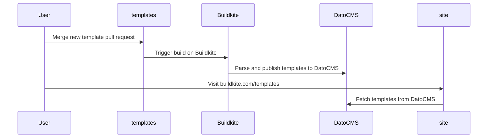

# Templates

A collection of Buildkite Pipelines starter templates that are showcased on the [template gallery](https://buildkite.com/templates).

## Creating a new template

A pipeline template is defined using the following structure:

```
.
└── pipelines/
    └── snowflake-data-ingestion-pipeline/
        ├── pipeline.yaml
        └── README.md
```

### `README.md`

This file contains a detailed description of what a specific template definition is and how it works.

A template `README.md` MUST include the following metadata defined as YAML frontmatter:

- `name` – The name of the pipeline template.
- `description` – The meta description for the template.
- `tags` – The attributes the pipeline template will be grouped by. Such as NextJS, Rails, Ruby, AWS or Deploy.
- `author` - The author of the pipeline template

### `pipeline.yaml`

A Buildkite Pipeline definition [file](https://buildkite.com/docs/pipelines/defining-steps).

## DatoCMS

The templates defined in this repository are ingested into DatoCMS.


