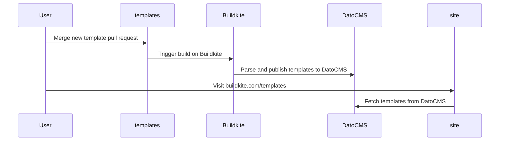

# Templates

A collection of starter templates for Buildkite Pipelines showcased in the buildkite.com template gallery.

## Creating a new template

A pipeline template is defined using the following structure:

```
.
└── pipelines/
    └── snowflake-data-ingestion-pipeline/
        ├── pipeline.yaml
        └── template.md
```

### `template.md`

This file contains a detailed description of what a specific template definition is and how it works.

A template MUST include the following metadata defined as YAML frontmatter:

- `name` – The name of the pipeline template.
- `categories` – The categories this pipeline template will be grouped under.

### `pipeline.yaml`

A Buildkite Pipeline definition [file](https://buildkite.com/docs/pipelines/defining-steps).

## Templates -> DatoCMS

The templates defined in this repository are ingesting into DatoCMS.


